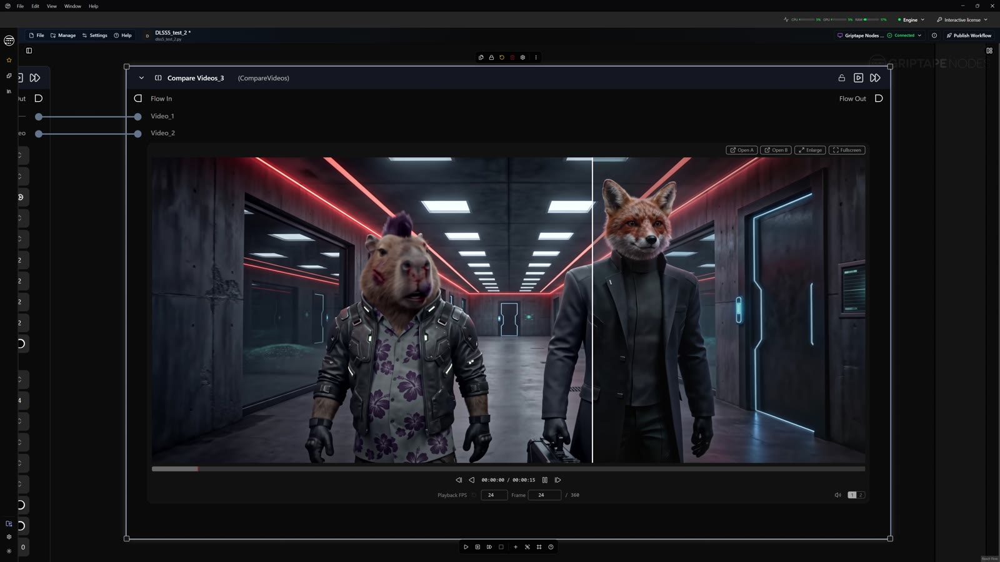

# GTN DLSS 5 Neural Rendering

Prototype Griptape Nodes library that runs video through **NVIDIA DLSS 5 Neural
Rendering** (DLSS-NR, NGX Feature 18) and optionally **DLSS Super Resolution**.

## Demo

<!-- INLINE_VIDEO: drag Griptape_DLSS5_Demo_readme_720p.mp4 into the GitHub README editor here to get an inline player -->

[](https://github.com/Amaru-Zeas/griptape-nodes-library-dlss5/releases/download/demo-video/Griptape_DLSS5_Demo.mp4)

*60 s walkthrough, 4K. Click the image to download the full-quality video (73 MB).*

The node drives one of two external worker processes; both own a D3D12 device, load the
NGX runtime and speak a packed-binary protocol over stdin/stdout.
`dlss5_nodes/dlss5_worker_bridge.py` is a pure-Python client for both;
`dlss5_nodes/dlss5_video_node.py` is the Griptape node on top of it.

| Backend | Where it comes from | Pros | Cons |
| --- | --- | --- | --- |
| **`merserk`** (recommended) | The worker inside Merserk's [DLSS 5 Visual Enhancer](https://github.com/Merserk/dlss5-visual-enhancer/releases) app (`bin\runtime\nvngx.dll`). Protocol documented by [ComfyUI-DLSS5-Enhancer](https://github.com/Blueforcer/ComfyUI-DLSS5-Enhancer). | Complete runtime in one download, works on RTX 30/40/50, Feature 18 execution is *verified* from `ReShade.log`. | RGBA8 in/out; ~4 s worker start per run; optical flow computed in Python. |
| **`native`** | `DLSS5Worker.exe` built from [DLSS5-for-Nuke](https://github.com/KJzzzKJ/DLSS5-for-Nuke) `worker/` via `build_worker.ps1`. | RGBA16F, in-worker optical flow, long-lived process (instant preview re-runs). | You must supply `nvngx_dlssnr.dll` yourself; needs a C++ toolchain to build. |

> Experimental. Both workers rely on undocumented NGX runtime behaviour observed by their
> upstream projects. Not affiliated with NVIDIA, Foundry, Griptape, Merserk or Blueforcer.
> Driver and runtime updates can break it.

## Requirements

| Component | Requirement |
| --- | --- |
| OS | Windows 10/11 x64 |
| GPU | NVIDIA RTX 40/50 (RTX 30 experimental) for the `merserk` backend; Blackwell for `native` |
| Driver | Current Game Ready / Studio driver with DLSS 5 support |
| Python deps | `imageio[ffmpeg]`, `numpy`, `pillow`, `opencv-python-headless` (installed by the engine from `griptape_nodes_library.json`) |

## Setup

### The one-click way

Install the library, add the **Instructions** node and press **Download & install the
DLSS 5 runtime**. It fetches the latest DLSS 5 Visual Enhancer release from Merserk's
GitHub (~520 MB, one time), verifies the SHA-256 GitHub publishes for the asset, unpacks
it into `%LOCALAPPDATA%\griptape_nodes\dlss5\<tag>\` and writes the library setting
`dlss5.runtime_dir`. Both nodes then work with `runtime_dir` left empty. The download
only ever talks to `github.com`; NVIDIA's runtimes are never shipped inside this
library. (`runtime_installer.py` is plain Python and can be run from a script too.)

Note on signatures: the installer reports the Authenticode status of the NVIDIA DLLs.
In v7.0 `nvngx_dlss.dll` is NVIDIA-signed, `nvngx_dlssnr.dll` is **not** (Merserk ships
a modified "universal" build of the NR snippet). Integrity of what you downloaded is
guaranteed by the SHA-256 check; whether to trust the modified snippet is your call, same
as when using the Visual Enhancer app itself.

### Option A - DLSS 5 Visual Enhancer worker, by hand

1. Download a **release zip** of DLSS 5 Visual Enhancer from
   <https://github.com/Merserk/dlss5-visual-enhancer/releases> and unzip it anywhere.
   A `git clone` of the repository is *not* enough: the worker binaries ship only in the
   release zips. v7.0 is recommended (universal DLSS NR runtime, faster on Ada/Blackwell);
   v3.0 also works. Both speak worker protocol "version 4", which this bridge implements;
   the flat (≤ v5) and split `host/` `dlss/` `dlssnr/` (≥ v6) runtime layouts are both
   recognised.
2. Point the node's `runtime_dir` at the unzipped app folder (its `bin\runtime` or
   `bin\runtime\host` also work), or set the environment variable `DLSS5_RUNTIME_DIR` once.
3. If antivirus quarantines `nvngx.dll` (it is an executable despite the name), add the
   runtime folder to the exclusion list.
4. Register the library in Griptape Nodes by pointing it at
   `dlss5_nodes/griptape_nodes_library.json`.

The runtime must contain `nvngx.dll`, `dxgi.dll`, `renodx-dlss5.addon64`,
`nvngx_dlss.dll` and `nvngx_dlssnr.dll` (flat, or under `host/`, `dlssnr/`, `dlss/`);
the node reports what is missing.

### Option B - bundled native worker

1. Build the worker once (needs VS2022 Build Tools with C++, CMake, Ninja, git):

   ```powershell
   powershell -ExecutionPolicy Bypass -File build_worker.ps1
   ```

   This clones the upstream repo into `_worker_src/`, applies `worker_patches/main.cpp`
   (reports the init failure reason on stderr) and writes `DLSS5Worker.exe` plus the
   caller shim `nvngx.dll` into `dlss5_nodes/runtime/`.

2. Give the worker a **`nvngx_dlssnr.dll`**. The **Live Preview** node needs nothing more
   than a configured DLSS 5 Visual Enhancer folder: it loads the snippet (and
   `nvngx_dlss.dll` for upscaling) from there in place. For the render node's `native`
   backend, copy a legitimately obtained copy into `dlss5_nodes/runtime/`.
   This is NVIDIA's DLSS 5 Neural Rendering snippet. It is not in any public NVIDIA SDK
   download; it arrives with DLSS 5 game installs and the DLSS 5 SDK for registered
   developers. It is never redistributed by this library and is `.gitignore`d. The NGX
   core (`_nvngx.dll`) is found automatically in the NVIDIA driver store.

3. Leave `runtime_dir` empty (and `DLSS5_RUNTIME_DIR` unset).

Backend selection: an explicit `runtime_dir` / `DLSS5_RUNTIME_DIR` Merserk folder wins;
otherwise the bundled native worker is used if its snippet is present; otherwise the node
fails with instructions for both options. The chosen backend is the first log line.

## Node: DLSS 5 Neural Render (Video)

The library ships three nodes: **Instructions** (a read-me note with setup steps, best
settings and troubleshooting), **DLSS 5 Neural Render (Video)** (batch render, either
backend) and **DLSS 5 Live Preview** (real-time sliders on a looping clip + bake, native
worker only - see below).

Layout: the `video` row sits at the top with its input port on the left and a pass-through
output port (the untouched original) on the right; `output_video` is directly underneath
(ports only, no embedded players or thumbnails). The `quality` preset is the first control,
the individual look controls follow, then the **Advanced** group (expanded), the `report`,
and a collapsed **Logs** group.

| Preset | `model_preset` | `intensity` | `local_tone` | `local_structure` | `skin_structure` |
| --- | --- | --- | --- | --- | --- |
| Ultra (max realism) | M | 1.0 | 1.0 | 2.0 | 2.0 |
| High | L | 1.0 | 1.0 | 1.5 | 1.5 |
| Medium | K | 1.0 | 0.8 | 1.0 | 1.0 |
| Low (subtle) | Default | 0.7 | 0.5 | 0.5 | 0.5 |

`auto_mask` is on for every preset. Ultra is the default and is the combination measured to
look best on generated footage; the remaining defaults are single-frame pipeline and 1.0x.

| Parameter | Description |
| --- | --- |
| `video` | Input video artifact (left port). The right port on the same row passes the original video through untouched - feed it and `output_video` into a Compare Video node for a before/after. |
| `output_video` | Neural-rendered video (VideoUrlArtifact, port only), already saved to the project via `output_file`. Connect to Display Video / Compare Video. |
| `quality` | One-click preset, first control on the node: `Ultra (max realism)` (default), `High`, `Medium`, `Low (subtle)`, `Custom`. Sets `model_preset`, `intensity`, `local_tone`, `local_structure`, `skin_structure` and `auto_mask`; touching any of those by hand flips it to `Custom`. All presets render at the same speed - only `upscale_mode` changes render time. |
| `output_file` | Filename for the rendered video (default `dlss5.mp4`). Saved through the project's `save_node_output` situation - by default `{outputs}/<node name>_<file>` in the current project, with a numeric suffix instead of overwriting. Edit the project's `griptape-nodes-project.yml` to change the macro, or press the cog to attach a **File Output Settings** node and pick another situation. Preview frames are saved next to it as `<name>_preview_f0010.png`. Nothing goes to the static-files folder any more. |
| `mode` | `Render full video -> output_video` (default) processes every frame. `Test one frame only -> preview_image` processes a single frame in a few seconds for trying slider values; the result lands on the `preview_image` port inside **Advanced** and `output_video` stays empty. |
| `upscale_mode` | `1.0x` = NR only. `1.5x` / `1.72x` / `2.0x` / `3.0x` add a DLSS Super Resolution pass. Output is capped at 7680×4320. |
| `nr_style` | `Default` / `Natural` (closer to source) / `Cinematic` (deeper shadows, more contrast). |
| `intensity` | Neural pass strength, 0–2. Current runtimes clamp at 1.0; values below 1 blend back toward the source. |
| `local_tone` | Low-frequency lighting / colour response, 0–2. |
| `local_structure` | High-frequency detail (AO, reflections, materials), 0–2. Default 2.0. |
| `skin_structure` | Skin / pore reconstruction, −1..2. Only active while `auto_mask` is on. Default 2.0. |
| `auto_mask` | Let the model find the regions it treats as skin; also gates `skin_structure`. Default on. |
| **Advanced** | |
| `pipeline` | `Single Frame` resets temporal history every frame (no ghosting; recommended for generated video). `Sequence` keeps history and feeds estimated optical flow (DIS): in-worker for `native`, client-side OpenCV for `merserk`. |
| `scene_change_threshold` | Sequence mode, `merserk` backend: mean luminance change (0.01–1) above which history is reset as a scene cut. Default 0.24. |
| `dis_preset` | Optical-flow quality for Sequence mode, `native` backend only (480p fast → 1280p extreme). |
| `model_preset` | DLSS model preset. Measured on generated footage: `Default`/`J`/`K` softest, `L` and `M` reconstruct noticeably more skin/hair texture. Default `M`. If the runtime rejects it the node says so; use `Default`. |
| `nr_preset` | Tuning preset. Measured to have no effect on current runtime builds. |
| `color_transfer` | `native` backend only: hand sRGB as-is (game backbuffer convention) or linearise first (the Nuke node's convention). Ignored by `merserk` (RGBA8 as encoded). |
| `keep_audio` | Copy the source audio track into the rendered output. |
| `browser_proxy` | On by default. Browsers (and NVDEC) hardware-decode H.264 only up to 4096 px, so any render larger than 3840x2160 would stutter in Display Video. When that happens the node also writes `<name>_proxy.mp4` (UHD-fitted, H.264 High 5.1, CRF 19, audio copied) and puts *that* on `output_video`; `output_file` always keeps the full-resolution master. The `report` shows `port: WxH proxy` when it kicked in. |
| `preview_frame` | Frame index used in test-one-frame mode. |
| `preview_image` | Output port (ImageUrlArtifact) for test-one-frame mode. No thumbnail on the node; connect a Display Image node. |
| `runtime_dir` | Path to a DLSS 5 Visual Enhancer install (`bin\runtime` or app root). Empty = library setting, then `DLSS5_RUNTIME_DIR`, else the bundled native worker. |
| `verify_neural_rendering` | `merserk` backend: after the run, require `ReShade.log` evidence that signed Feature 18 actually ran; fail otherwise (plain DLSS upscaling would otherwise look like success). Default on. |
| **Results** | |
| `report` | One-line summary; ends with `NR verified` when evidence was checked. |
| `logs` | Worker / verification log for the last run (collapsed **Logs** group). |

With the `native` backend the worker process is kept alive between runs while settings
and input size are unchanged, so preview re-runs skip D3D12/NGX initialisation. The
`merserk` worker is started and stopped per run because ReShade only flushes its log on
exit.

## Node: DLSS 5 Live Preview

Real-time version of the render node: the clip loops through a resident native worker
and the result is shown *inside the node* while you drag the sliders. Look changes
(`local_tone`, `local_structure`, `skin_structure`, `auto_mask`, `nr_style`) apply on the
next frame; `upscale_mode`, `temporal`, `model_preset` and `dis_preset` hot-swap the
worker in ~1.5 s while the old one keeps rendering. Nothing here touches the render node.

Runtime: it always uses the bundled `DLSS5Worker.exe` (Option B build) but loads
`nvngx_dlssnr.dll` / `nvngx_dlss.dll` straight out of a DLSS 5 Visual Enhancer install
(`runtime_dir`, library setting or `DLSS5_RUNTIME_DIR`), so you do **not** have to copy
any NVIDIA DLL. If no Visual Enhancer folder is configured it falls back to DLLs placed
next to the worker.

How to use:

1. Connect a video, press **Start live preview**. First frame appears after ~1.5 s
   (D3D12 + NGX init); the clip then loops at its own frame rate while a decoder thread
   fills the RAM cache behind it.
2. Drag on the picture to move the **wipe** (source left, DLSS 5 right). View menu:
   wipe / after / before / split. Transport: play-pause, step, scrubber, and a speed
   menu (0.25x-2x, or **Max** = as fast as the pipeline goes).
3. Move the sliders or pick a `look`; watch the result change live.
4. Press **Bake full clip with these settings** (or run the node in a flow). Every frame
   is rendered with the current settings, saved through the project's
   `save_node_output` situation via `output_file` (default `dlss5_live.mp4`, no static
   folders) and placed on `output_video`. The live loop pauses during the bake and
   resumes afterwards.
5. **Stop live preview** releases the GPU worker. The session also stops itself when the
   node is deleted, when the engine exits, or after 20 s without anyone watching the
   stream (worker stays resident and resumes when the preview is visible again).

| Parameter | Description |
| --- | --- |
| `video` / `output_video` | Same layout as the render node: input on the left, pass-through on the right, baked result underneath (port only). |
| `live_preview` | The preview widget (MJPEG stream from a `127.0.0.1` server owned by the node; wipe/transport commands go straight to that server, not through the engine). |
| `look` | `Ultra` (default), `High`, `Medium`, `Low`, `Custom`. Sets the four look sliders; touching a slider flips it to `Custom`. Intensity is pinned at 1.0 because the current runtime only darkens the frame below 1.0 when changed on a running worker. |
| `local_tone` / `local_structure` / `skin_structure` / `auto_mask` / `nr_style` | As in the render node; live. |
| `upscale_mode` | 1.0x-3.0x; hot-swap. |
| `temporal` | `Single Frame` (default, no ghosting) or `Sequence` (history + in-worker DIS optical flow); hot-swap. |
| `output_file` | Bake filename (project situation template, cog for File Output Settings). |
| **Advanced** | `model_preset` (SR pass only, hot-swap), `dis_preset` (Sequence flow quality, hot-swap), `keep_audio` (bake), `browser_proxy` (bake: same UHD proxy rule as the render node), `max_cache_gb` (RAM for decoded frames, default 8 GB = ~55 s of 1080p or ~13 s of 4K; longer clips loop their first part), `preview_width` (the stream is downscaled to this width for the widget, default 1280 - the worker and the bake stay full-res), `preview_quality` (stream JPEG quality), `runtime_dir`. |
| `report` / `logs` | Bake summary and worker / session log (collapsed **Logs** group). |

Performance. The loop is four threads (decode -> send -> receive -> compose/encode) with
two frames inside the worker at a time, so the frame time is the slowest stage rather than
the sum. Measured on an RTX PRO 6000, single-frame 1.0x:

| Source | GPU time / frame | Loop at **Max** speed | 1x playback |
| --- | --- | --- | --- |
| 1920×1080 | ~6 ms | ~107 fps (9 ms) | 24.0 fps, exact |
| 3840×2160 | ~17 ms | ~37 fps (27 ms) | 24.0 fps, exact |
| 3840×2160 -> 2x (7680×4320) | ~40-50 ms | ~16 fps | 16 fps (GPU-bound) |

GPU utilisation stays in the single digits at 1080p and low tens at 4K. That is expected:
DLSS 5 NR is a per-frame network sized for a game's frame budget, so it finishes in a few
milliseconds and the GPU idles until the next frame arrives. The HUD in the widget shows
`fps · ms GPU · ms/frame · ms preview` so you can see which stage is limiting.

## What to expect

- DLSS 5 NR is a one-step diffusion model trained to add photoreal lighting and
  materials to *game renders*, conditioned on colour + motion vectors. On already
  photoreal generated video the visible effect is skin/hair/fabric micro-detail and tonal
  shifts. Measured by the ComfyUI project on generated footage: preset `M` + `auto_mask`
  + `skin_structure` 2 + `local_structure` 2 gives the most convincing faces (the defaults).
- Use `Single Frame` for generated clips to avoid ghosting from estimated optical flow;
  use `Sequence` for real footage or renders with coherent motion.
- The SR pass (`upscale_mode` > 1.0x) is a temporally stable ms-per-frame upscaler and is
  the most broadly useful part for generated footage. With the `merserk` worker the log
  line "NR upscaling fell back to native" means DLSS upscaled first and the neural pass
  ran at output resolution; the result is still upscaled and neurally rendered.
- Rendering is pipelined: a producer thread decodes and letterboxes, DIS optical flow
  (Sequence mode) is solved on a small thread pool, a sender thread keeps two frames in
  flight inside the worker, and the main thread receives results in order and hands them
  to ffmpeg. The worker's ~20 ms GPU round-trip therefore overlaps all CPU work. Measured
  at 1920×1080 1x on an RTX PRO 6000: ≈ 16 ms/frame single-frame, ≈ 18 ms/frame with
  optical flow (≈ 55-60 frames of footage per second). GPU utilisation stays low (the
  neural pass is only a few ms of each frame); frames per second is the number to watch.

## Protocol reference

Both workers share the magic numbers, the 48-byte `SetupResponse`, the 24-byte
`FrameHeader` and the 28-byte `FrameResponse`.

- `native` (`worker/Protocol.h` upstream): 96-byte `VideoHeader`; pixels are tightly
  packed RGBA16F; optional per-frame guides are RG16F motion (external MV mode), R32F
  depth and R32F control mask. `DLSS5Worker.process()` exposes `depth` / `control_mask`
  / `motion` for a future CG-passes node (Blender/UE motion vectors).
- `merserk` (protocol version 4): 72-byte `VideoHeader` (14 × u32 + 4 × f32, magic
  `D5V4`); every frame is RGBA8 letterboxed to the *negotiated* render size followed by
  an FP16 RG motion buffer (current → previous, in render pixels; zeros when disabled);
  the response is RGBA8 at output size. The header's `frame_count` is an exact contract;
  `0` selects streaming mode (worker ≥ v6), where the client ends the stream with an
  `END1` record carrying the real count and reads a 28-byte acknowledgement. The node
  uses streaming for renders (imageio's frame count is only an estimate) and an exact
  count of 1 for previews. `MerserkWorker` letterboxes automatically and `TemporalGuide`
  produces the motion buffer.

Measured on an RTX PRO 6000 Blackwell with Visual Enhancer v7.0: worker start ≈ 3.6 s
(15 s on the first run while shaders compile) plus ≈ 0.6 s for the first frame, then
≈ 16 ms/frame at 1920×1080 1x, ≈ 18 ms/frame at 1080p 1x with client-side optical flow,
≈ 40 ms/frame at 2x from 720p (2560×1440 out) with optical flow. The worker itself takes
≈ 20 ms per frame regardless of resolution; everything else is hidden behind it by the
pipeline. `MerserkWorker.send()` / `receive()` expose the in-flight protocol for other
callers (`process()` is the sequential pair).

## License

Library code: MIT. Upstream native worker code: MIT (KJzzzKJ/DLSS5-for-Nuke); protocol
notes for the Visual Enhancer worker are from Blueforcer/ComfyUI-DLSS5-Enhancer (MIT).
NVIDIA, DLSS and NGX are trademarks of NVIDIA Corporation; their runtimes are not covered
by this license and are not distributed here. The DLSS 5 Visual Enhancer itself is a
separate download with its own terms.
